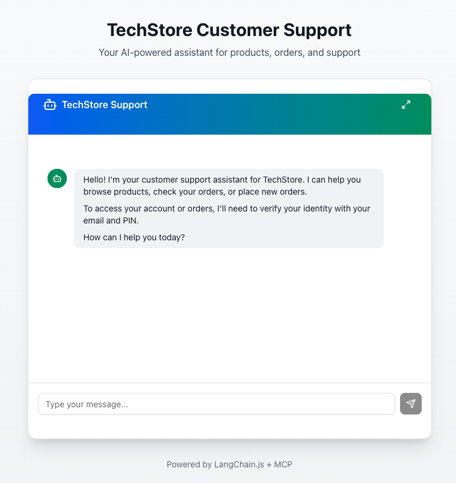
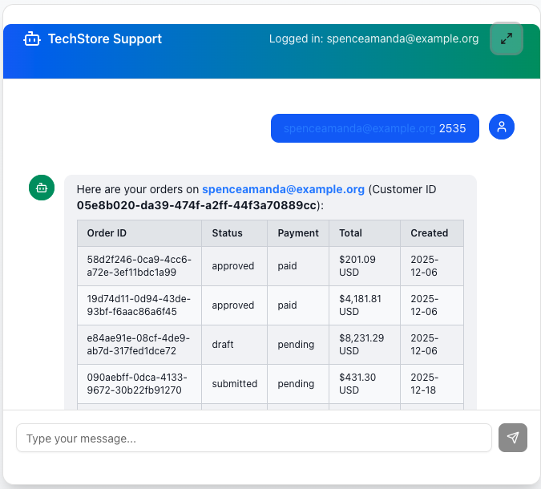
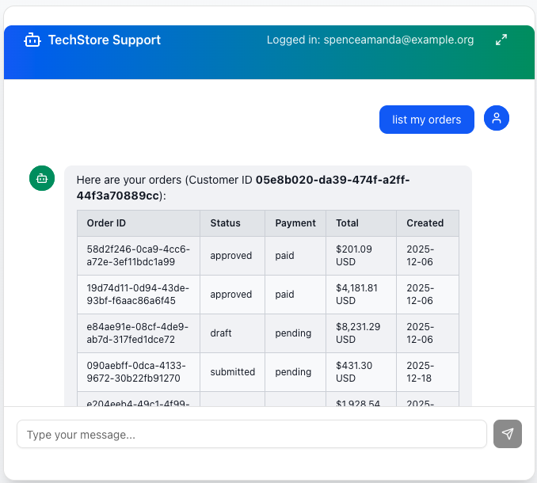
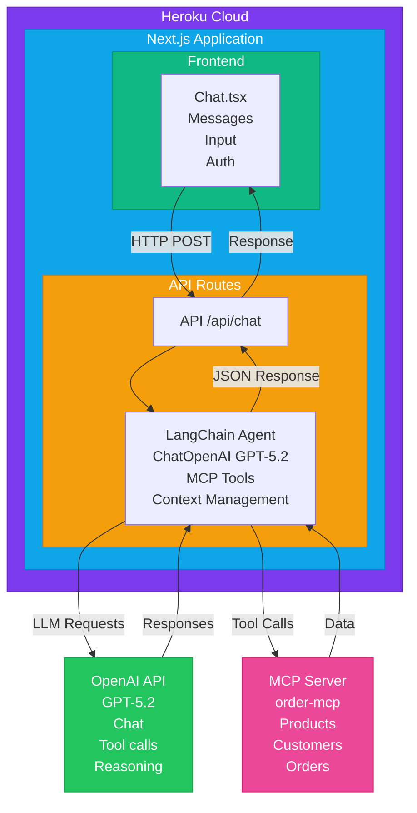

# 🤖 TechStore Customer Support Chatbot

An AI-powered customer support chatbot built with **LangChain.js**, **Next.js**, and the **Model Context Protocol (MCP)**. This chatbot helps customers browse products, manage orders, and get support for a computer products company.


---

## 📋 Table of Contents

- [Features](#-features)
- [Demo](#-demo)
- [Architecture](#-architecture)
- [Tech Stack](#-tech-stack)
- [Getting Started](#-getting-started)
- [Project Structure](#-project-structure)
- [MCP Integration](#-mcp-integration)
- [Deployment](#-deployment)
- [Environment Variables](#-environment-variables)
- [Testing](#-testing)
- [Troubleshooting](#-troubleshooting)
- [Future Enhancements](#-future-enhancements)
- [License](#-license)

---

## ✨ Features

- **🔐 Customer Authentication** - Secure login with email and 4-digit PIN
- **📦 Product Browsing** - Search and browse products by category
- **🛒 Order Management** - View order history and place new orders
- **🧠 AI-Powered Responses** - Natural language understanding with GPT-5.2
- **🔧 MCP Tool Integration** - Real-time data from company backend
- **💬 Conversational UI** - Modern chat interface with message history
- **📱 Responsive Design** - Works on desktop and mobile devices
- **📊 Observability** - Full tracing with Langfuse for monitoring and debugging

---

## 🎥 Demo

**Live Demo:** [https://techstore-support-chatbot-45b97833c047.herokuapp.com](https://techstore-support-chatbot-45b97833c047.herokuapp.com)

### Test Credentials

| Email | PIN |
|-------|-----|
| `donaldgarcia@example.net` | `7912` |
| `michellejames@example.com` | `1520` |
| `laurahenderson@example.org` | `1488` |

### Sample Conversations

```
User: "Show me monitors"
Bot: Lists available monitors with prices and stock

User: "I want to log in with donaldgarcia@example.net and PIN 7912"
Bot: Verifies identity and greets customer by name

User: "Show my orders"
Bot: Displays customer's order history

User: "I want to order a 27-inch monitor"
Bot: Guides through order placement process
```

### Screenshots

<div align="center">

#### Chat Interface


*Modern chat interface with gradient header and responsive design*

---

#### Customer Authentication


*Secure customer login with email and PIN verification*

---

#### Order History


*Formatted order history with markdown tables*

</div>

---

## 🏗 Architecture



### Request Flow

1. **User sends message** → React UI captures input
2. **POST /api/chat** → Message sent to API route
3. **LangChain Agent** → Analyzes message, decides on tools
4. **Tool Execution** → Calls MCP server for data (if needed)
5. **LLM Response** → GPT-5.2 generates natural response
6. **UI Update** → Response displayed in chat

---

## 🛠 Tech Stack

| Layer | Technology | Purpose |
|-------|------------|---------|
| **Frontend** | Next.js 16, React 19 | UI framework |
| **Styling** | Tailwind CSS 4, shadcn/ui | Modern, responsive design |
| **AI Orchestration** | LangChain.js | Agent + tool management |
| **LLM** | OpenAI GPT-5.2 | Natural language processing |
| **Protocol** | MCP (Streamable HTTP) | Backend integration |
| **Language** | TypeScript | Type safety |
| **Observability** | Langfuse | Tracing & monitoring |
| **Deployment** | Heroku | Cloud hosting |

---

## 🚀 Getting Started

### Prerequisites

- **Node.js** 18+ 
- **npm** 9+
- **OpenAI API Key**
- **Heroku CLI** (for deployment)

### Installation

```bash
# Clone the repository
git clone https://github.com/yourusername/techstore-chatbot.git
cd techstore-chatbot

# Install dependencies
cd app
npm install

# Set up environment variables
cp .env.example .env.local
# Edit .env.local with your API keys

# Run development server
npm run dev
```

Open [http://localhost:3000](http://localhost:3000) in your browser.

---

## 📁 Project Structure

```
henry_asessment/
├── README.md                    # This file
├── docs/
│   ├── task.md                  # Original assessment task
│   └── architecture.md          # Detailed architecture docs
├── scripts/
│   └── explore-mcp.mjs          # MCP server exploration script
└── app/                         # Next.js application
    ├── src/
    │   ├── app/
    │   │   ├── layout.tsx       # Root layout
    │   │   ├── page.tsx         # Home page with Chat
    │   │   └── api/
    │   │       └── chat/
    │   │           └── route.ts # Chat API endpoint
    │   ├── components/
    │   │   ├── Chat.tsx         # Main chat container
    │   │   ├── ChatMessage.tsx  # Message bubble component
    │   │   ├── ChatInput.tsx    # Input field component
    │   │   └── ui/              # shadcn/ui components
    │   └── lib/
    │       ├── mcp-client.ts    # MCP server connection
    │       ├── mcp-tools.ts     # LangChain tool wrappers
    │       ├── langchain-agent.ts # Agent configuration
    │       ├── langfuse-client.ts # Observability tracing
    │       └── utils.ts         # Utility functions
    ├── .env.local               # Environment variables (local)
    ├── .env.example             # Environment template
    ├── Procfile                 # Heroku process file
    ├── next.config.ts           # Next.js configuration
    ├── tailwind.config.js       # Tailwind configuration
    └── package.json             # Dependencies
```

---

## 🔌 MCP Integration

### What is MCP?

The **Model Context Protocol (MCP)** is a standardized protocol for connecting AI models to external data sources and tools. This chatbot uses MCP to communicate with the company's backend services.

### MCP Server Details

- **URL:** `https://vipfapwm3x.us-east-1.awsapprunner.com/mcp`
- **Protocol:** Streamable HTTP
- **Server:** `order-mcp` v1.22.0

### Available Tools

| Tool | Description | Parameters |
|------|-------------|------------|
| `verify_customer_pin` | Authenticate customer | `email`, `pin` |
| `get_customer` | Get customer details | `customer_id` |
| `list_products` | Browse products | `category?`, `is_active?` |
| `get_product` | Get product by SKU | `sku` |
| `search_products` | Search products | `query` |
| `list_orders` | List customer orders | `customer_id?`, `status?` |
| `get_order` | Get order details | `order_id` |
| `create_order` | Place new order | `customer_id`, `items[]` |

### Tool Wrapping Example

```typescript
// MCP tools are wrapped as LangChain DynamicStructuredTools
const searchProductsTool = new DynamicStructuredTool({
  name: "search_products",
  description: "Search products by name or description keyword.",
  schema: z.object({
    query: z.string().describe("Search term"),
  }),
  func: async ({ query }) => {
    return await callMCPTool("search_products", { query });
  },
});
```

---

## 📊 Observability

### Langfuse Integration

This chatbot includes **Langfuse** for full observability of AI interactions, enabling monitoring, debugging, and analytics.

### What's Tracked

| Component | Description |
|-----------|-------------|
| **Traces** | Each conversation session |
| **Generations** | LLM calls with input/output |
| **Spans** | Individual tool calls (MCP) |
| **Sessions** | Grouped by unique session ID |
| **Users** | Identified by customer email |
| **Metadata** | Auth status, tools used, iterations |

### Features

- **Session Grouping** - All messages in a conversation are grouped together
- **Tool Call Tracking** - Each MCP tool call is tracked with input/output
- **Error Tracking** - Failed operations are logged with error details
- **Performance Metrics** - Latency and token usage monitoring
- **Public Sharing** - Generate shareable links for specific traces

### Configuration

```bash
# Required environment variables
LANGFUSE_SECRET_KEY=sk-lf-xxx
LANGFUSE_PUBLIC_KEY=pk-lf-xxx
LANGFUSE_HOST=https://us.cloud.langfuse.com
```

### Viewing Traces

1. Access [Langfuse Dashboard](https://us.cloud.langfuse.com)
2. Navigate to **Traces** to see all conversations
3. Click on a trace to see detailed breakdown
4. Use **Sessions** view to see grouped conversations

---

## 🚢 Deployment

### Heroku Deployment

#### 1. Create Heroku App

```bash
# Login to Heroku
heroku login

# Create new app
heroku create techstore-chatbot

# Or connect to existing app
heroku git:remote -a techstore-chatbot
```

#### 2. Configure Environment Variables

```bash
heroku config:set OPENAI_API_KEY=sk-your-api-key
heroku config:set MCP_SERVER_URL=https://vipfapwm3x.us-east-1.awsapprunner.com/mcp
heroku config:set NODE_ENV=production
```

#### 3. Deploy

```bash
# From the app directory
cd app

# Initialize git if needed
git init
git add .
git commit -m "Initial deploy"

# Push to Heroku
git push heroku main
```

#### 4. Verify Deployment

```bash
# Open the app
heroku open

# Check logs
heroku logs --tail
```

### Heroku Configuration Files

**Procfile:**
```
web: npm start
```

**next.config.ts:**
```typescript
const nextConfig: NextConfig = {
  output: "standalone",
};
```

### Build Process

Heroku automatically:
1. Detects Node.js application
2. Runs `npm install`
3. Runs `npm run build`
4. Starts with `npm start` (via Procfile)

---

## 🔐 Environment Variables

| Variable | Required | Description |
|----------|----------|-------------|
| `OPENAI_API_KEY` | ✅ | OpenAI API key for GPT-5.2 |
| `MCP_SERVER_URL` | ✅ | MCP server endpoint |
| `NODE_ENV` | ❌ | `development` or `production` |
| `LANGFUSE_SECRET_KEY` | ❌ | Langfuse observability (optional) |
| `LANGFUSE_PUBLIC_KEY` | ❌ | Langfuse observability (optional) |
| `LANGFUSE_HOST` | ❌ | Langfuse host URL (optional) |

### Setting Up Locally

```bash
# Copy the example file
cp .env.example .env.local

# Edit with your values
nano .env.local
```

---

## 🧪 Testing

### Manual Testing

1. **Product Browsing:**
   - "Show me all products"
   - "What monitors do you have?"
   - "Search for printers"

2. **Authentication:**
   - "Login with donaldgarcia@example.net and PIN 7912"
   - "Verify my account"

3. **Order Management:**
   - "Show my orders" (requires auth)
   - "What's the status of my last order?"

4. **Order Placement:**
   - "I want to order a monitor" (requires auth)

### Test Customers

| Email | PIN | Notes |
|-------|-----|-------|
| `donaldgarcia@example.net` | `7912` | Primary test account |
| `michellejames@example.com` | `1520` | Secondary test |
| `laurahenderson@example.org` | `1488` | Has order history |
| `spenceamanda@example.org` | `2535` | - |
| `glee@example.net` | `4582` | - |

### Running the MCP Explorer

```bash
# From project root
node scripts/explore-mcp.mjs
```

This script connects to the MCP server and lists all available tools.

---

## 🔧 Troubleshooting

### Common Issues

#### 1. "OPENAI_API_KEY is not set"

**Cause:** Missing or invalid API key

**Solution:**
```bash
# Check if variable is set
echo $OPENAI_API_KEY

# On Heroku
heroku config:get OPENAI_API_KEY

# Set it
heroku config:set OPENAI_API_KEY=sk-your-key
```

#### 2. "MCP Error: Not Acceptable"

**Cause:** Missing `Accept` header in MCP requests

**Solution:** Ensure `mcp-client.ts` includes:
```typescript
headers: {
  "Content-Type": "application/json",
  "Accept": "application/json",
}
```

#### 3. Chat Input Disappears

**Cause:** Flexbox overflow issue

**Solution:** The `Chat.tsx` component uses:
```tsx
<CardContent className="flex-1 flex flex-col p-0 min-h-0">
  <div className="flex-1 overflow-y-auto">...</div>
  <div className="flex-shrink-0">
    <ChatInput />
  </div>
</CardContent>
```

#### 4. "Model not found: gpt-5.2"

**Cause:** Model name not available in your OpenAI account

**Solution:** Update `langchain-agent.ts`:
```typescript
const model = new ChatOpenAI({
  model: "gpt-4o-mini", // or another available model
  temperature: 0.7,
});
```

#### 5. Heroku Build Fails

**Cause:** Usually missing dependencies or Node version issues

**Solution:**
```bash
# Check build logs
heroku logs --tail

# Specify Node version in package.json
"engines": {
  "node": "18.x"
}

# Clear cache and rebuild
heroku builds:cache:purge -a your-app-name
git push heroku main
```

#### 6. Tool Calls Not Working

**Cause:** LLM not calling tools correctly

**Solution:** Check the system prompt in `langchain-agent.ts` and ensure tool descriptions are clear.

### Debug Mode

Add logging to API route:
```typescript
// In /api/chat/route.ts
console.log("Messages:", JSON.stringify(messages, null, 2));
console.log("Context:", JSON.stringify(context, null, 2));
```

View logs:
```bash
# Local
npm run dev  # Console output

# Heroku
heroku logs --tail
```

---

## 🔮 Future Enhancements

### Short-term
- [ ] **Streaming responses** - Real-time token streaming for better UX
- [ ] **Conversation persistence** - Save chat history across sessions
- [ ] **Langfuse integration** - Full observability and tracing

### Medium-term
- [ ] **Multi-language support** - i18n for international customers
- [ ] **Voice input** - Speech-to-text integration
- [ ] **Rich product cards** - Images and interactive elements
- [ ] **Order tracking** - Real-time status updates

### Long-term
- [ ] **Human handoff** - Escalation to live agents
- [ ] **Analytics dashboard** - Conversation insights
- [ ] **A/B testing** - Prompt optimization
- [ ] **Fine-tuned model** - Custom model for domain knowledge

---

## 📄 License

This project is part of the Henry GenAI MCP Assessment.

---

## 👤 Author

Built with ❤️ for the Henry AI Engineering Assessment

---

## 🙏 Acknowledgments

- [LangChain.js](https://js.langchain.com/) - AI orchestration framework
- [Model Context Protocol](https://modelcontextprotocol.io/) - MCP specification
- [shadcn/ui](https://ui.shadcn.com/) - Beautiful UI components
- [Next.js](https://nextjs.org/) - React framework
- [Heroku](https://heroku.com/) - Cloud platform
